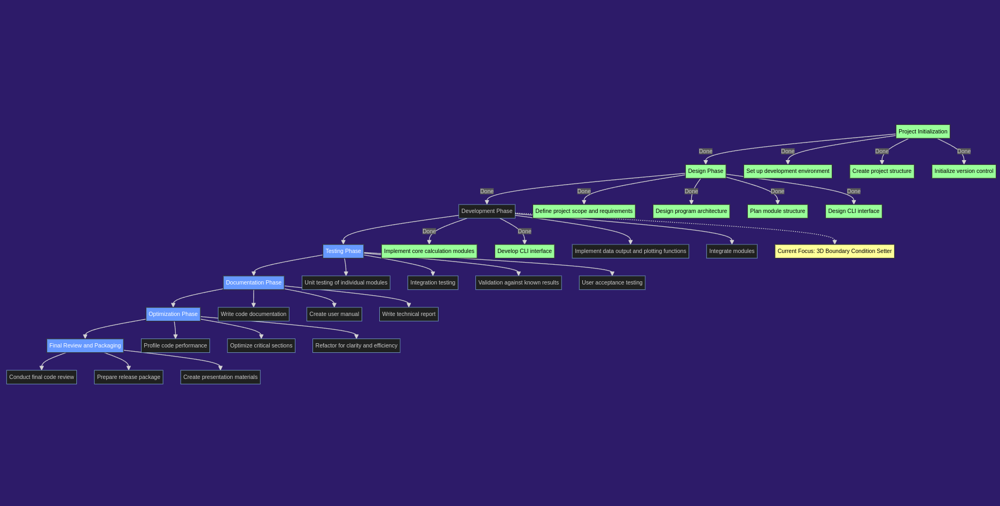

# Reactor Simulation Project

## Project Overview
This project is a comprehensive reactor simulation tool developed in Fortran, designed to model and analyze various aspects of nuclear reactor physics. It employs one-group diffusion theory to simulate neutron behavior in different reactor geometries, providing insights into critical reactor parameters and neutron flux distributions.

## Features
- One-group diffusion calculations for multiple reactor geometries:
  - Slab reactor
  - Cylindrical reactor
  - Spherical reactor
  - Reflected reactor
- Critical dimension calculations
- Neutron flux distribution analysis
- K-infinity and effective multiplication factor (k-eff) calculations
- Parametric studies for reactor design optimization
- Data output for visualization of results

## Computational Neutronics Skills Demonstrated
- Implementation of one-group diffusion theory
- Numerical solutions to neutron diffusion equations
- Modeling of neutron behavior in various reactor geometries
- Criticality calculations and analysis
- Neutron flux and power distribution computations
- Application of boundary conditions in neutron transport problems

## Nuclear Engineering Concepts Applied
- Reactor core design principles
- Understanding of neutron lifecycle in fission reactors
- Analysis of moderator and reflector effects on reactor performance
- Fuel utilization and burnup considerations
- Control rod worth calculations
- Temperature effects on reactor behavior

## Technical Skills Developed
- Fortran programming for scientific computing
- Command-line interface design for user interaction
- Modular code structure for complex scientific applications
- Numerical methods for solving differential equations
- Data processing and output for scientific visualization
- Version control using Git for project management

## Future Enhancements
- Multi-group diffusion calculations
- Time-dependent analysis for transient behavior
- Monte Carlo methods for more accurate neutron transport simulations
- Integration with thermal-hydraulic models for coupled neutronic-thermal analysis

## Software Architecture
# Roadmap

# Reactor Calculations

---

This project demonstrates a practical application of nuclear engineering principles and computational methods, showcasing skills relevant to the field of reactor physics and design.
